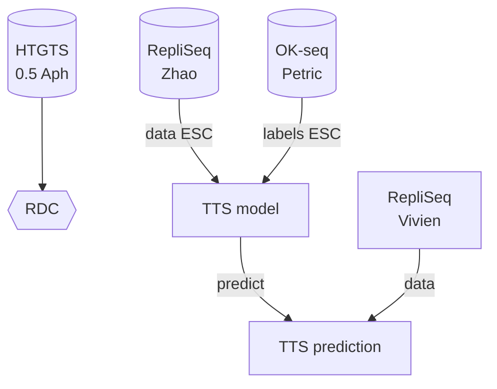

Datasets
## Tables

| Data     | Source            | Celltype           | Treatment                    | Organism | Processed |
|----------|-------------------|--------------------|------------------------------|----------|:----------|
| HTGTS    | Wei PNAS 2018     | NPC                | APH / DMSO                   | Mouse    | Yes       |
| HTGTS    | Tena PNAS 2018    | NPC, ESC           | APH / DMSO                   | Mouse    | Yes       |
| HTGTS    | Tena PNAS 2018    | NPC, ESC           | APH / DMSO                   | Mouse    | Yes       |
| HTGTS    | Wang Cell 2020    | NPC                | APH / DMSO                   | Human    | No        |
| HTGTS    | HTGTS             | NPC                | APH (0.2-0.6) / DMSO         | Mouse    | Partial   |
| HTGTS    | HTGTS-genes       | NPC -genes*        | APH / DMSO                   | Mouse    | Yes       |
| HTGTS    | HTGTS_inverse     | NPC inverse gene*  | APH / DMSO                   | Mouse    | N/A       |
| RepliSeq | Zhao GeneBio 2020 | NPC, ESC           | DMSO                         | Mouse    | Yes       |
| RepliSeq | RepSeq-1          | NPC                | APH (4frac) / DMSO (8frac)   | Mouse    | Yes       |
| RepliSeq | RepSeq-2          | NPC                | APH (8frac+) / DMSO (8frac+) | Mouse    | N/A       |
| OK-seq   | Petric            | ESC                | DMSO                         | Mouse    | Yes       |
| GROseq   | GROseq            | ESC                | DMSO???                      | Mouse    | Yes       |

##Hypothesis
We want to prove that one of the reasons for RDC formation is head-on collission from replication and transcription forks

##Plan
1. Continue collecting TLX files
2. Find replication termination sites
3. Use

#repliseq_zhao[(RepliSeq Zhao)]--data NPC-->repliseq_zhao[(RepliSeq Zhao)];
      
      #id4[TTS]-->id5{TTS enrichment}
      C-->D;

*TTS - Transcription termination site